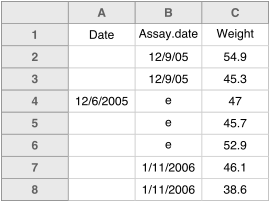

When you're talking about formatting dates, you've got to lead with
this [xdcd](https://xkcd.com) comic:

  [xkcd.com](https://xkcd.com/1179/)

Excel does
[crazy things with dates](https://storify.com/kara_woo/excel-date-system-fiasco). It
stores them internally as an integer, counting the days since
1900-01-01. Wait that's only for Windows; on Macs, it counts the days
since 1904-01-01.

So, be careful to check that the dates haven't been mangled when your
data come out of Excel.

Excel also has a tendency to turn other things into dates:

Personally, I'd be inclined to convert columns in an Excel worksheet
that are going to contain dates into a plain text format:

- Select the column
- In the menu bar, select Format → Cells
- Then choose "Text" on the left

But really what I wanted to emphasize here: be consistent in the way
in which you write dates. And really, always use the `YYYY-MM-DD`
format, as in the [xkcd comic, above](https://xkcd.com/1179/).

I have an old Excel spreadsheet in front of me that looks a bit like
this:

 

I never did quite understand what those `e`'s were for, but having
different date formats within a column can cause headaches later.

Use care about dates, and be consistent.

---

Next up: [Fill in all of the cells](no_empty_cells.html).
