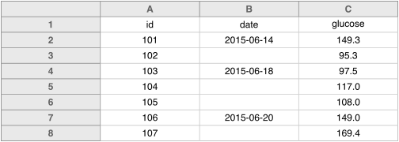
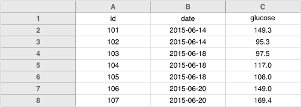
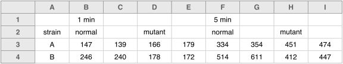
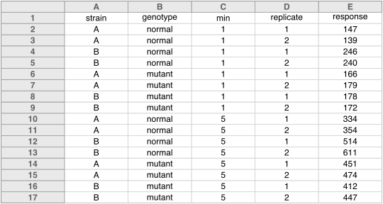

Fill in all cells. Use some common code for missing data.
Not everyone agrees with me (for example,
[White et al. (2013)](http://library.queensu.ca/ojs/index.php/IEE/article/view/4608/4898)
state a preference for leaving cells blank), but I'd prefer to have
"`NA`" or even a hyphen in the cells with missing data, to make sure
it's clear that the data are known to be missing rather than
unintentially left blank.

I also often see cells left blank when a single value is meant to be
repeated multiple times. For example, one might put the date in only a
few cells, like this:

 

**Don't do that!** If the rows were to be sorted at some point, that
date column would be completely mangled.

It's much better to fill them all in, like this:

 

I also see this sort of thing for information about different
treatments. For example, I recently saw a file like the following:

 

We'll [talk more about layout next](layout.html), but while it's sort
of clear, to a human, what's intended above, it's hard to convince a
computer of that.

You could fill in some of those cells, to make it more clear, but even
better would be to make a "tidy" version of the data
([more on what is meant by "tidy" later](tidy.html)), as follows:

 

**No empty cells!**

---

Next up: [Make it a rectangle](layout.html).
