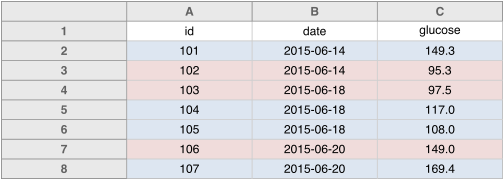

You might be tempted to highlight particular cells with suspicious
data, or rows that should be ignored. Add another column
with an indicator variable (for example, `"trusted"`, with values
`TRUE` or `FALSE`).

Here's an example with males highlighted in blue and females in
pink. Rather than use highlighting to indicate sex, it's better to
include a `sex` column, with values `Male` or `Female`.

 

---

Next up: [Choose good names for things](names.html).
